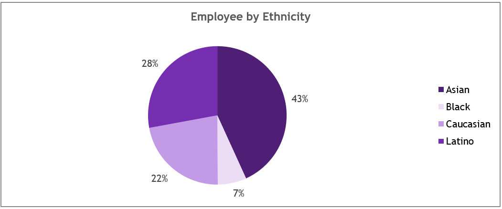

# Employee-Hiring-And-Demographics-Analysis
## Introduction
This project focuses on analyzing employee hiring trends, demographic distributions, compensation patterns, and departmental salary insights across a multinational organization. The aim is to uncover meaningful patterns and provide actionable recommendations based on workforce data visualization. 
## Overview
The dashboard provides a comprehensive view of various human resources metrics. These include top earners, hiring trends, gender and ethnic diversity, average salaries, and departmental performance by compensation. The data is visualized in an intuitive format using bar charts, pie charts, and line graphs for better stakeholder understanding.
## Problem Statement
Organizations with a growing and diverse workforce often lack clarity on the effectiveness of their hiring strategies, compensation equity, and demographic diversity. This analysis seeks to address:
-	Who are the top-performing and best-paid employees?
-	Which departments and roles attract the highest salaries?
-	Are hiring patterns consistent or improving?
-	How diverse is the workforce by gender, ethnicity, and geography?
## Skills Demonstrated
-	Data Cleaning and Transformation using Excel
-	Dashboard Creation using Excel Pivot Tables and Charts
-	Visual Storytelling through Data Visualization
-	Exploratory Data Analysis (EDA)
-	Insight Derivation and Reporting
-	HR and Demographic Analytics
## Data Source
The dataset was Downloaded from Kaggle. The Datasets includes fields such as:
-	Employee name
-	Department
-	Ethnicity
-	Gender
-	Job title
-	Country
-	Annual salary
-	Year of hire
## Data Cleaning and Transformation
The raw dataset underwent the following transformations:
-	Missing and duplicate values were removed.
-	Categorical values (e.g., departments, ethnicities) were standardized.
-	Salary and hiring year fields were converted into numeric formats.
-	Derived columns like average salary by department and hiring year ranges were created for trend analysis.
## Exploratory Data Analysis
The data was explored using visual and statistical methods to identify trends, distributions, and anomalies. Pivot tables and charting functions in Excel were utilized to aggregate key metrics and segment insights by demographic dimensions.
## Insights and Chart Analysis
### Top Earning Employee 

- Robert Rogers tops the list with a salary of $258,734.
-	The top three earners have salaries within a close range ($258,700+), suggesting a competitive executive tier.
### Best Hiring Year
- 2022 recorded the highest number of hires, with 233 employees, reflecting a recent expansion or hiring push.
### Top Country by Employee Population
### 
-	United States has the highest workforce representation (634 employees), followed by China (227) and Brazil (139).
### Top Hired Ethnicity

-	Asian employees form the largest ethnic group, accounting for 43% of the workforce.

### Highest Earning Department
-	Human Resources leads with an average annual salary of $125,218, slightly ahead of Marketing and Accounting.
### Average Salary
-	The overall average salary across all employees is $109,323.
### Hiring Trend Analysis

-	The trend from 1993 to 2022 shows a consistent increase in hiring, peaking significantly from 2017–2022.
### Gender Distribution

-	Fairly balanced gender distribution: 51% male and 49% female, indicating strong gender diversity.
### Department Salary Analysis
-	Other high-paying departments include:
-	Marketing – $124,603
-	Accounting – $122,646
-	Finance – $120,331
-	Engineering trails at $107,888
### Top Job Titles by Average Salary
-	Vice Presidents command the highest salaries ($220,126), followed by:
-	Directors – $174,542
-	Senior Managers – $141,747

### Employee by Ethnicity
-	Ethnic representation includes:
-	Asian – 43%
-	Caucasian – 28%
-	Latino – 22%
-	Black – 7%

### Recommendations
-	Recruiting Focus: Continue expansion efforts in diverse countries and ethnic groups to enhance global representation.
-	Equity in Pay: Conduct deeper analysis to ensure pay equity across departments and demographics.
-	Talent Retention: With recent hiring spikes, invest in programs for retention, especially for top earners and new hires.
-	Engineering Compensation Review: Engineering lags in average salary; consider a review to stay competitive in technical talent markets.
-	Gender Diversity Programs: Maintain and improve gender balance, possibly introducing leadership training for underrepresented groups.

### Conclusion
The dashboard offers a powerful lens into employee demographics and salary trends. It helps stakeholders make data-driven decisions in talent acquisition, compensation planning, and diversity initiatives. Continued updates and integration with live data sources can enhance strategic workforce planning.
